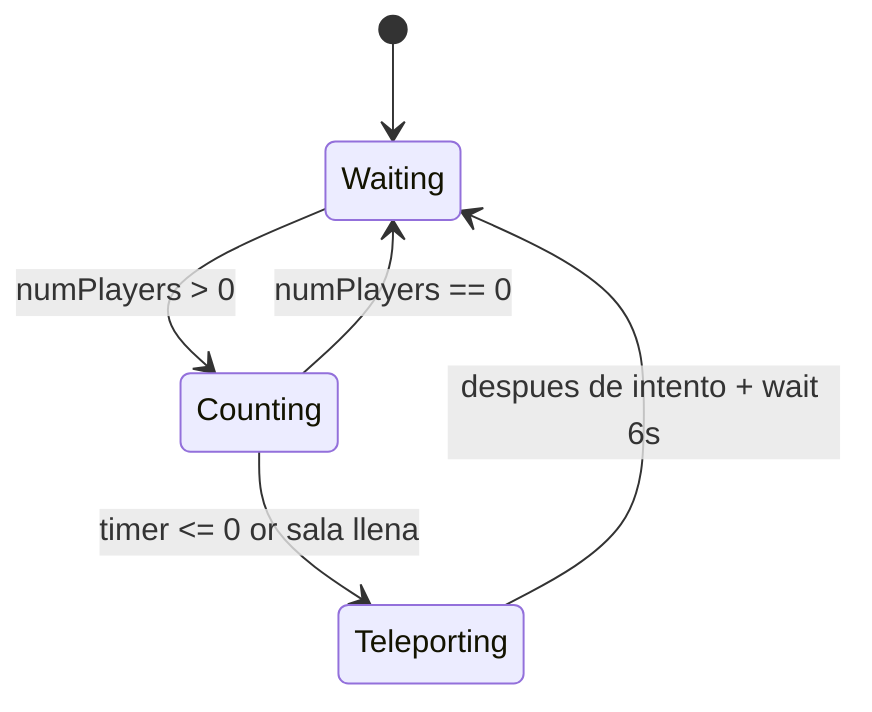
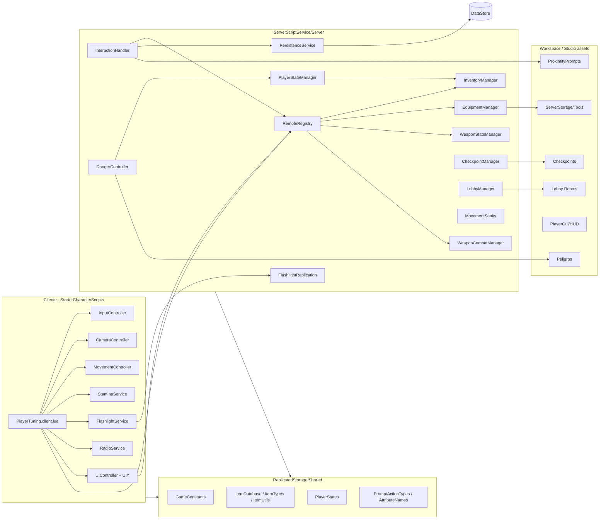
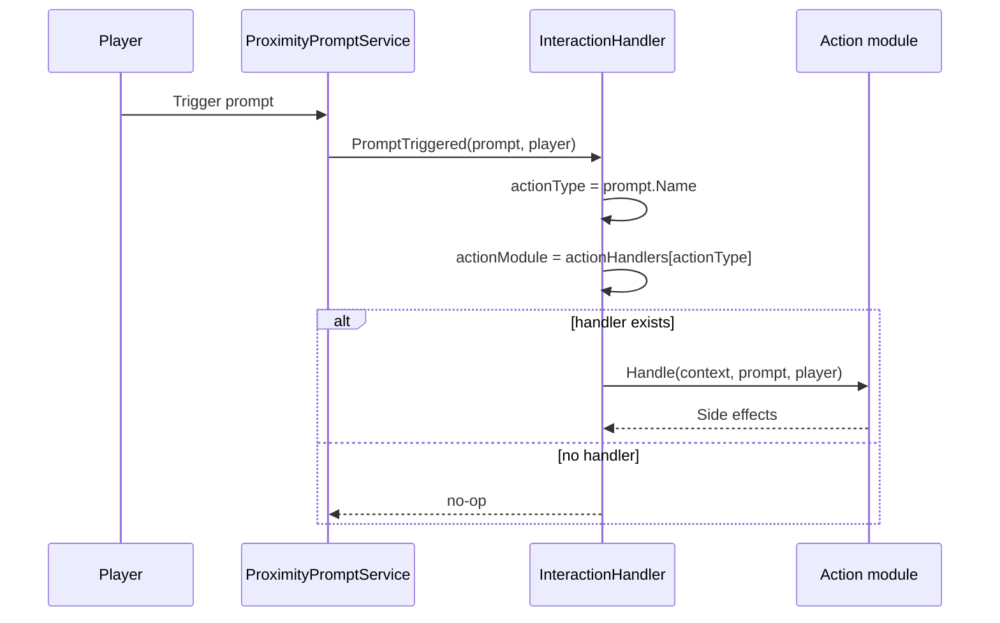
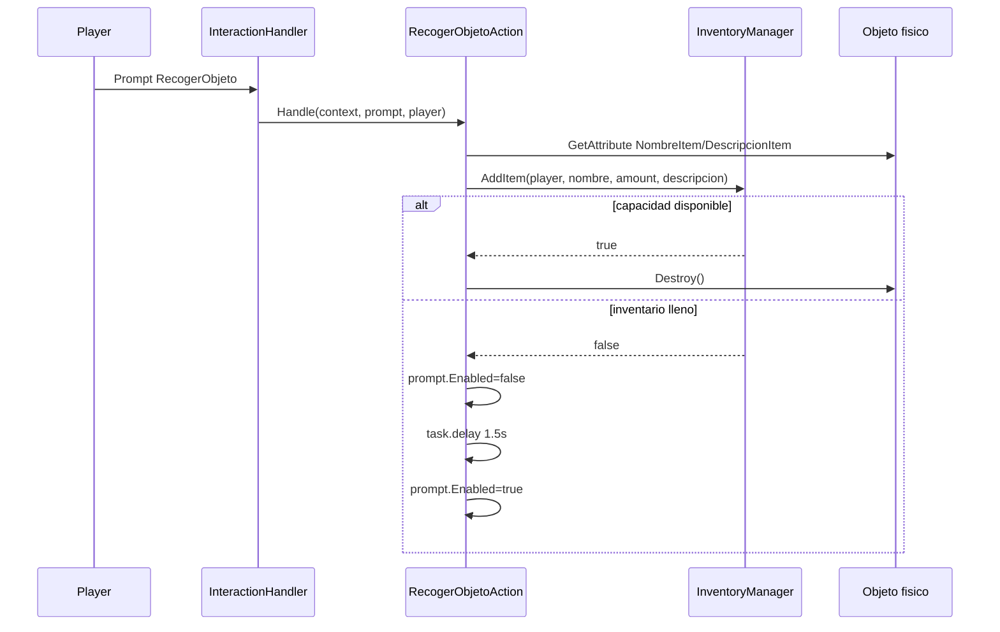
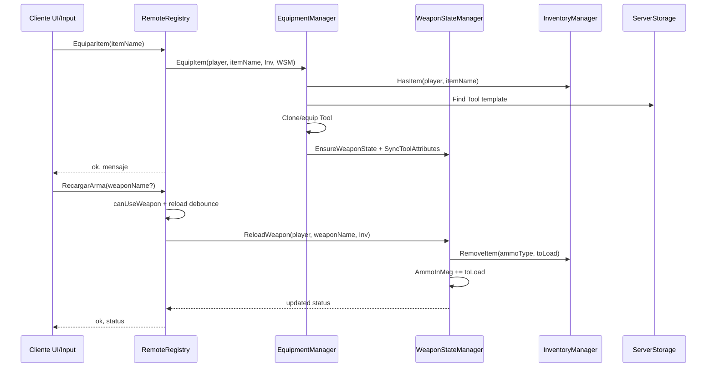
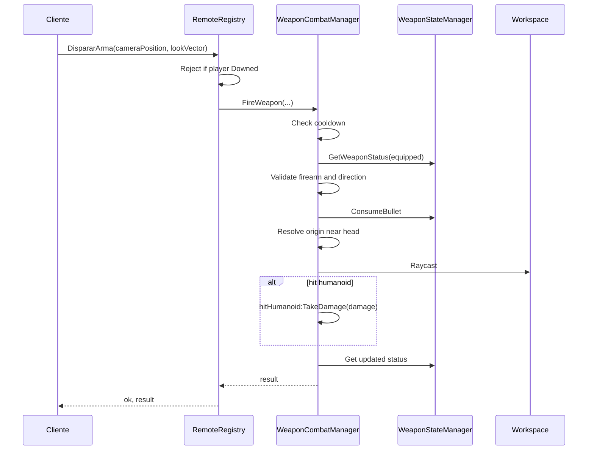
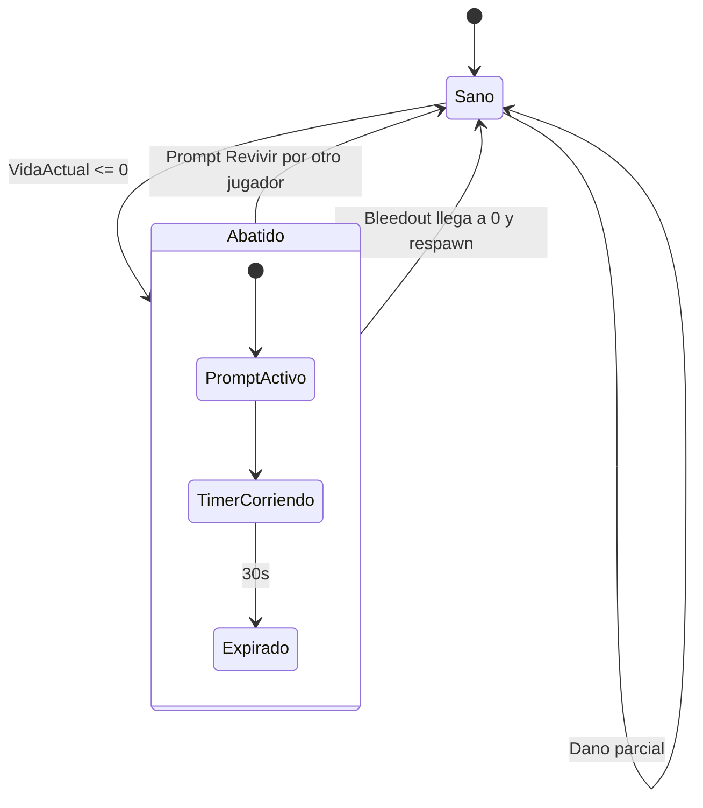
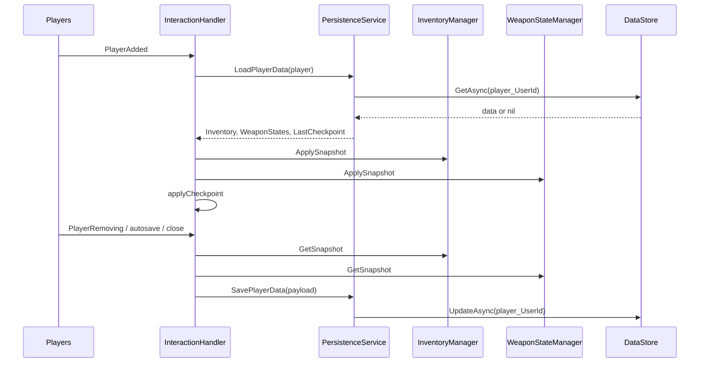
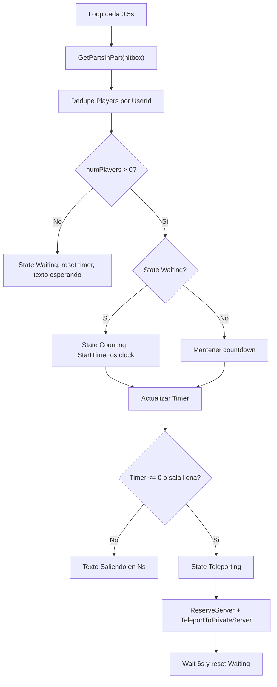
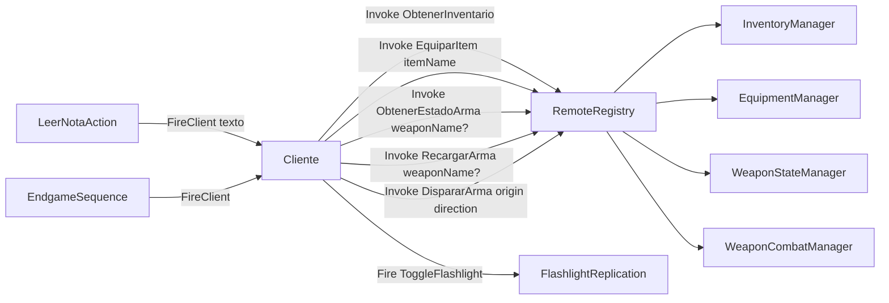

# Analisis tecnico - Iteracion 1

Proyecto: Echoes in the Fog  
Alcance: todo el proyecto incluido en este repositorio.  
Objetivo: documentar el funcionamiento actual sin modificar codigo ni asumir arquitectura no comprobada.

## 1. Resumen ejecutivo

Echoes in the Fog es un juego de horror/survival cooperativo en Roblox. El README confirma las mecanicas actuales: control en tercera persona, stamina, inventario, armas de fuego y melee, interacciones por `ProximityPrompt`, IA de peligro, checkpoints, estados de jugador y lobby multijugador con teletransporte.

La estructura Rojo define tres areas principales:

| Area Roblox | Ruta repo | Responsabilidad confirmada |
|---|---|---|
| `ReplicatedStorage/Shared` | `src/shared` | Constantes, tipos, catalogos y utilidades compartidas. |
| `ServerScriptService/Server` | `src/server` | Entry points de servidor, managers, persistencia, interacciones y acciones. |
| `StarterPlayer/StarterCharacterScripts` | `src/client` | Entry point de cliente por personaje, controladores de input, camara, movimiento, UI, linterna y radio. |
| `Workspace/Scene` | `src/workspace/scene` | Mapeado en Rojo, pero vacio en el repo actual. |

Separacion confirmada:

- Cliente: controla experiencia local, input, camara, movimiento local, UI, sonidos locales, radio y solicitudes a remotos.
- Servidor: registra remotos, valida acciones autoritativas, maneja inventario, armas, salud, estados, respawn, persistencia, lobby, checkpoints, IA y prompts.
- Shared: centraliza constantes, catalogo de items, nombres de atributos, tipos de prompts, estados y normalizacion de nombres.

Limitacion importante: varios objetos criticos no estan versionados en `src/workspace/scene` ni en el repo. El codigo espera que existan en Roblox Studio, por ejemplo `Workspace/Checkpoints`, `Workspace/Peligros`, `Workspace/Lobby/Hub_Multijugador/SalasDeEspera`, `PlayerGui/HUD`, `ServerStorage/Tools`, puertas con `Bisagra`, sonidos, prompts y algunos RemoteEvents.

## 2. Metodologia aplicada

Este analisis siguio entrypoints y dependencias directas, no un recorrido indiscriminado.

Orden seguido:

1. Revisar `default.project.json` para entender montaje Rojo.
2. Localizar scripts `.server.lua` y `.client.lua`.
3. Seguir `require` desde entrypoints.
4. Identificar `RemoteEvent`, `RemoteFunction`, eventos de jugador, `ProximityPromptService`, loops y timers.
5. Revisar managers llamados por los entrypoints.
6. Revisar acciones de `ProximityPrompt`.
7. Revisar modulos compartidos que definen reglas y datos.
8. Buscar persistencia, integraciones Roblox y tests.
9. Detener lectura cuando el archivo no aportaba a los flujos principales.

## 3. Mapa de carpetas y componentes

| Ruta | Tipo | Contexto | Responsabilidad | Dependencias principales |
|---|---|---|---|---|
| `default.project.json` | Config Rojo | Build/sync | Mapea `src` a servicios Roblox. | Rojo, DataModel. |
| `README.md` | Documento | Repo | Resume mecanicas y arquitectura. | Ninguna. |
| `src/shared/ModuleScripts/GameConstants.lua` | ModuleScript | Compartido | Constantes de puertas, jugador, endgame, cliente, armas y servidor. | Ninguna. |
| `src/shared/ModuleScripts/ItemDatabase.lua` | ModuleScript | Compartido | Catalogo de consumibles, melee, armas de fuego y municion. | Ninguna. |
| `src/shared/ModuleScripts/ItemTypes.lua` | ModuleScript | Compartido | Tipos canonicos de item. | Ninguna. |
| `src/shared/ModuleScripts/ItemUtils.lua` | ModuleScript | Compartido | Normalizacion de nombres de item. | Ninguna. |
| `src/shared/ModuleScripts/PlayerStates.lua` | ModuleScript | Compartido | Estados canonicos `Sano` y `Abatido`, aliases legacy. | Ninguna. |
| `src/shared/ModuleScripts/PromptActionTypes.lua` | ModuleScript | Compartido | Nombres de acciones de prompt. | Ninguna. |
| `src/shared/ModuleScripts/AttributeNames.lua` | ModuleScript | Compartido | Nombres de atributos usados por objetos/personajes. | Ninguna. |
| `src/client/PlayerTuning.client.lua` | LocalScript | Cliente, por personaje | Entry point cliente; inicializa controladores y loop de render. | CoreModules, `GameConstants`, remotos de armas. |
| `src/client/CoreModules/InputController.lua` | ModuleScript | Cliente | Input teclado, mouse, touch y gamepad; callbacks de linterna, recarga y disparo. | `UserInputService`, `ContextActionService`. |
| `src/client/CoreModules/CameraController.lua` | ModuleScript | Cliente | Camara tercera persona con yaw/pitch y offset. | `GameConstants`. |
| `src/client/CoreModules/MovementController.lua` | ModuleScript | Cliente | Movimiento local basado en input, camara, stamina, salud y estado. | `GameConstants`, `PlayerStates`. |
| `src/client/CoreModules/StaminaService.lua` | ModuleScript | Cliente | Drena/regenera stamina y expone `CanRun`. | `GameConstants`. |
| `src/client/CoreModules/FlashlightService.lua` | ModuleScript | Cliente | Solicita toggle de linterna y renderiza flicker local. | `ToggleFlashlight`, atributos. |
| `src/client/CoreModules/InteractionService.lua` | ModuleScript | Cliente | UX local de prompts; oculta prompt propio de revive. | `ProximityPromptService`. |
| `src/client/CoreModules/RadioService.lua` | ModuleScript | Cliente | Sonido de estatica segun cercania a `Workspace/Peligros`. | `GameConstants`, `Workspace`. |
| `src/client/CoreModules/UIController.lua` | ModuleScript | Cliente | Carga subcontroladores UI y desactiva CoreGui Backpack/PlayerList. | `StarterGui`, `PlayerGui/HUD`. |
| `src/client/CoreModules/UI/InventoryUIController.lua` | ModuleScript | Cliente | UI dinamica de inventario, equipar y recargar. | Remotos de inventario/armas, catalogos. |
| `src/client/CoreModules/UI/NotesUIController.lua` | ModuleScript | Cliente | Muestra panel de nota al recibir evento. | `EventoMostrarNota`, `HUD/PanelNota`. |
| `src/client/CoreModules/UI/EndgameUIController.lua` | ModuleScript | Cliente | Fade final al recibir evento. | `EventoFinJuego`, `TweenService`. |
| `src/client/CoreModules/UI/HealthHUDController.lua` | ModuleScript | Cliente | HUD de salud por atributos `VidaActual`/`Estado`. | `RunService`, `HUD/VisorEstado`. |
| `src/client/CoreModules/UI/CrosshairUIController.lua` | ModuleScript | Cliente | Crosshair visible si hay arma de fuego equipada. | `ItemDatabase`, `ItemTypes`. |
| `src/server/InteractionHandler.server.lua` | Script | Servidor | Orquestador de interacciones, remotos y persistencia. | Managers, acciones, remotos, `ProximityPromptService`. |
| `src/server/FlashlightReplication.server.lua` | Script | Servidor | Crea `ToggleFlashlight`; replica estado de linterna por atributo y `SpotLight`. | `Players`, `ReplicatedStorage`. |
| `src/server/DangerController.server.lua` | Script | Servidor | IA de monstruos, pathfinding y dano por contacto. | `PathfindingService`, `PlayerStateManager`. |
| `src/server/CheckpointManager.server.lua` | Script | Servidor | Guarda ultimo checkpoint al tocar parts. | `Workspace/Checkpoints`, `Players`. |
| `src/server/LobbyManager.server.lua` | Script | Servidor | Salas de espera, countdown y teletransporte privado. | `TeleportService`, `Workspace/Lobby`. |
| `src/server/MovementSanity.server.lua` | Script | Servidor | Deteccion basica de velocidad anomala y rollback. | `RunService`, `Players`. |
| `src/server/DevTestBootstrap.server.lua` | Script | Servidor Studio | Crea escena temporal de prueba en Studio. | `RunService:IsStudio`, prompts. |
| `src/server/ModuleScripts/RemoteRegistry.lua` | ModuleScript | Servidor | Crea/registra `RemoteFunction`s de inventario, equipo y armas. | Managers, `PlayerStates`. |
| `src/server/ModuleScripts/PersistenceService.lua` | ModuleScript | Servidor | DataStore de inventario, armas y checkpoint. | `DataStoreService`, `RunService`. |
| `src/server/ModuleScripts/InventoryManager.lua` | ModuleScript | Servidor | Inventario por `UserId`, add/remove/snapshot. | `ItemDatabase`, `ItemUtils`, `Logger`. |
| `src/server/ModuleScripts/EquipmentManager.lua` | ModuleScript | Servidor | Equipa Tools desde `ServerStorage`. | `ServerStorage`, inventario, armas. |
| `src/server/ModuleScripts/WeaponStateManager.lua` | ModuleScript | Servidor | Estado de cargador/municion por jugador/arma. | `ItemDatabase`, inventario. |
| `src/server/ModuleScripts/WeaponCombatManager.lua` | ModuleScript | Servidor | Disparo hitscan, cooldown, raycast y dano. | `Workspace`, armas. |
| `src/server/ModuleScripts/PlayerStateManager.lua` | ModuleScript | Servidor | Estado `Sano/Abatido`, salud, revive prompt, bleedout, respawn. | `HealthManager`, `RespawnManager`, `BleedoutTimer`. |
| `src/server/ModuleScripts/HealthManager.lua` | ModuleScript | Servidor | Atributos de vida y operaciones heal/damage. | Ninguna. |
| `src/server/ModuleScripts/RespawnManager.lua` | ModuleScript | Servidor | Teletransporta a checkpoint o fallback. | Atributos. |
| `src/server/ModuleScripts/BleedoutTimer.lua` | ModuleScript | Servidor | Timer y billboard de desangrado. | `PlayerStates`. |
| `src/server/ModuleScripts/Logger.lua` | ModuleScript | Servidor | Logger con niveles configurables. | `GameConstants`. |
| `src/server/Interactions/DoorAnimator.lua` | ModuleScript | Servidor | Tween de apertura/cierre de puerta por `Bisagra`. | `TweenService`, atributos. |
| `src/server/Interactions/EndgameSequence.lua` | ModuleScript | Servidor | Abre puerta final, dispara UI final y expulsa jugador. | `EventoFinJuego`, `DoorAnimator`. |
| `src/server/Interactions/Actions/*.lua` | ModuleScripts | Servidor | Handlers por tipo de prompt. | Contextos inyectados desde `InteractionHandler`. |

## 4. Inventario de entrypoints y triggers

| Trigger | Archivo | Funcion/evento | Contexto | Flujo iniciado |
|---|---|---|---|---|
| Montaje de personaje local | `src/client/PlayerTuning.client.lua` | Ejecucion del LocalScript | Cliente | Inicializacion de camara, UI, input, movimiento, radio y linterna. |
| Frame de render | `src/client/PlayerTuning.client.lua:165` | `RunService.RenderStepped` | Cliente | Actualizacion continua de input, stamina, movimiento, camara, linterna y radio. |
| Input teclado/mouse/gamepad/touch | `src/client/CoreModules/InputController.lua:216` | `UserInputService.InputBegan` | Cliente | Movimiento, toggle linterna, recarga, disparo. |
| Cambio input | `src/client/CoreModules/InputController.lua:286` | `UserInputService.InputChanged` | Cliente | Movimiento de camara mouse/touch. |
| Acciones moviles/gamepad | `src/client/CoreModules/InputController.lua:204` | `ContextActionService:BindAction` | Cliente | Correr, recargar, disparar. |
| Abrir inventario | `src/client/CoreModules/UI/InventoryUIController.lua:492` | `ContextActionService:BindAction` | Cliente | UI inventario y `ObtenerInventario`. |
| Click/activacion UI item | `src/client/CoreModules/UI/InventoryUIController.lua:425` | `MouseButton1Click` / `Activated` | Cliente | Equipar/recargar item seleccionado. |
| Evento nota | `src/client/CoreModules/UI/NotesUIController.lua:11` | `OnClientEvent` | Cliente | Mostrar texto de nota. |
| Evento fin | `src/client/CoreModules/UI/EndgameUIController.lua:12` | `OnClientEvent` | Cliente | Fade final. |
| Nuevo jugador | `src/server/InteractionHandler.server.lua:75` | `Players.PlayerAdded` | Servidor | Carga de persistencia. |
| Sale jugador | `src/server/InteractionHandler.server.lua:87` | `Players.PlayerRemoving` | Servidor | Guardado y limpieza. |
| Cierre servidor | `src/server/InteractionHandler.server.lua:95` | `game:BindToClose` | Servidor | Guardado de todos los jugadores. |
| Autosave | `src/server/InteractionHandler.server.lua:103` | `task.spawn` + `while task.wait` | Servidor | Guardado periodico si persistencia habilitada. |
| ProximityPrompt | `src/server/InteractionHandler.server.lua:174` | `ProximityPromptService.PromptTriggered` | Servidor | Dispatch a accion por `prompt.Name`. |
| Nuevo jugador/personaje | `src/server/ModuleScripts/PlayerStateManager.lua:206` | `Players.PlayerAdded` / `CharacterAdded` | Servidor | Inicializa estado y vida. |
| Toggle linterna | `src/server/FlashlightReplication.server.lua:73` | `ToggleFlashlight.OnServerEvent` | Servidor | Alterna atributo y SpotLight. |
| Monstruo toca jugador | `src/server/DangerController.server.lua:174` | `rootPart.Touched` | Servidor | Dano al jugador. |
| AI loop | `src/server/DangerController.server.lua:230` | `RunService.Heartbeat` | Servidor | Persecucion/patrulla. |
| Nuevo peligro | `src/server/DangerController.server.lua:226` | `dangersFolder.ChildAdded` | Servidor | Inicializa monstruo. |
| Checkpoint tocado | `src/server/CheckpointManager.server.lua:18` | `checkpoint.Touched` | Servidor | Actualiza `UltimoCheckpoint`. |
| Lobby scan | `src/server/LobbyManager.server.lua:118` | `while task.wait(0.5)` | Servidor | Estado de salas y teletransporte. |
| Sanity movimiento | `src/server/MovementSanity.server.lua:60` | `RunService.Heartbeat` | Servidor | Detecta desplazamiento excesivo. |
| Studio bootstrap | `src/server/DevTestBootstrap.server.lua:83` | Ejecucion en Studio | Servidor Studio | Crea objetos temporales de prueba. |

No se encontro uso de `BindableEvent`, `BindableFunction`, `ClickDetector`, comandos administrativos ni schedulers externos. Los loops/timers confirmados son `RenderStepped`, `Heartbeat`, autosave, lobby scan, `BleedoutTimer`, cooldowns/debounces y delays de UI/acciones.

## 5. Flujo de arranque del cliente

### Proposito

Inicializar la experiencia local cada vez que aparece un personaje: camara, movimiento, stamina, UI, linterna, radio, input y sonidos.

### Entry point

`src/client/PlayerTuning.client.lua`, ejecutado como `StarterCharacterScripts`.

### Pasos confirmados

1. Obtiene `Players`, `RunService`, `ReplicatedStorage`.
2. Requiere modulos de `CoreModules`.
3. Espera remotos de armas: `RecargarArma`, `DispararArma`, `ObtenerEstadoArma`.
4. Toma referencias a `Players.LocalPlayer`, `character`, `Humanoid`, `HumanoidRootPart`.
5. Crea sonidos locales `Gunshot` y `ReloadSound` bajo `HumanoidRootPart`.
6. Configura humanoid: `WalkSpeed = 0`, `JumpPower = 0`, `AutoRotate = false`, jumping deshabilitado.
7. Inicializa:
   - `CameraController:Reset()`
   - `FlashlightService:Init(character)`
   - `InteractionService:Init()`
   - `RadioService:Init(character)`
   - `UIController:Init(character)`
   - `InputController:Init(...)`
8. En cada `RenderStepped`:
   - `InputController:Update(dt)`
   - `StaminaService:Update(...)`
   - `MovementController:Update(...)`
   - `CameraController:Update(...)`
   - `FlashlightService:Update(dt)`
   - `RadioService:Update(hrp.Position)`

### Datos leidos

- `GameConstants.Client.*`
- `ItemDatabase` para `ReloadTimeSeconds`.
- Atributos de personaje `Estado`, `VidaActual`, `FlashlightOn`.
- `Workspace.CurrentCamera`.

### Datos modificados

- Propiedades del `Humanoid`.
- Velocidad fisica `HumanoidRootPart.AssemblyLinearVelocity`.
- `camera.CFrame`.
- Sonidos locales bajo HRP.

### Remotos usados

- `ObtenerEstadoArma`
- `RecargarArma`
- `DispararArma`
- `ToggleFlashlight` via `FlashlightService`

### Errores controlados

- `invokeServerSafe` envuelve `RemoteFunction:InvokeServer` con `pcall`.
- Warnings ante errores de red, falta de municion, fallo de recarga/disparo.

### Limitaciones

- El cliente ejecuta movimiento local cambiando velocidad fisica directamente. La autoridad final no esta centralizada en servidor; el servidor solo aplica sanity check basico.
- El delay de recarga se hace en cliente antes de pedir recarga al servidor. El servidor no verifica que haya pasado `ReloadTimeSeconds`.

### Evidencia

- `src/client/PlayerTuning.client.lua:84`
- `src/client/PlayerTuning.client.lua:89`
- `src/client/PlayerTuning.client.lua:107`
- `src/client/PlayerTuning.client.lua:124`
- `src/client/PlayerTuning.client.lua:149`
- `src/client/PlayerTuning.client.lua:165`

## 6. Flujo de arranque del servidor

El servidor no tiene un unico bootstrap central. Hay varios scripts `.server.lua` independientes bajo `src/server`.

### Scripts inicializados en paralelo por Roblox

| Script | Responsabilidad de arranque |
|---|---|
| `InteractionHandler.server.lua` | Configura managers, registra remotos, carga/guarda persistencia, despacha prompts. |
| `PlayerStateManager.lua` | Aunque es ModuleScript, al ser requerido conecta `Players.PlayerAdded` y `PlayerRemoving`. |
| `FlashlightReplication.server.lua` | Crea `ToggleFlashlight`, configura linterna en cada personaje. |
| `DangerController.server.lua` | Espera `Workspace/Peligros`, inicializa monstruos y loop de IA. |
| `CheckpointManager.server.lua` | Espera `Workspace/Checkpoints` y conecta `Touched`. |
| `LobbyManager.server.lua` | Intenta encontrar jerarquia de lobby y arranca loop si existe. |
| `MovementSanity.server.lua` | Conecta tracking de jugadores y loop de validacion de movimiento. |
| `DevTestBootstrap.server.lua` | Solo en Studio crea objetos temporales bajo `Workspace/DevTest`. |

### Dependencias de Studio/Workspace

- `CheckpointManager` usa `workspace:WaitForChild("Checkpoints")`. Si no existe, el script queda esperando.
- `DangerController` usa `workspace:WaitForChild("Peligros")`. Si no existe, queda esperando.
- `LobbyManager` usa `WaitForChild` con timeout y se deshabilita si falta la jerarquia.
- `UIController` espera `PlayerGui/HUD`.
- `EquipmentManager` busca Tools en `ServerStorage/Tools` o recursivamente en `ServerStorage`.

## 7. Mapa de flujos principales

### 7.1 Persistencia de jugador

| Campo | Detalle |
|---|---|
| Proposito | Cargar y guardar inventario, estado de armas y ultimo checkpoint. |
| Entry point | `Players.PlayerAdded`, `PlayerRemoving`, `BindToClose`, autosave. |
| Comienza en | Servidor. |
| Scripts | `InteractionHandler.server.lua`, `PersistenceService.lua`, `InventoryManager.lua`, `WeaponStateManager.lua`. |
| Roblox services | `DataStoreService`, `RunService`, `Players`. |
| Clave | `player_` + `player.UserId`. |
| Store | `EchoesInTheFog_PlayerData_V1`. |
| Datos guardados | `Inventory`, `WeaponStates`, `LastCheckpoint`, `UpdatedAt`. |
| Valores por defecto | Inventario `{}`, armas `{}`, checkpoint `nil`. |
| Errores | `GetAsync` y `UpdateAsync` envueltos en `pcall`; fallback vacio y warning. |
| Tests | No encontrados. |

Pasos:

1. `PlayerAdded` llama `loadPlayerData` dentro de `task.spawn`.
2. `PersistenceService:LoadPlayerData(player)` retorna datos o defaults.
3. `InventoryManager:ApplySnapshot(player, loaded.Inventory)`.
4. `WeaponStateManager:ApplySnapshot(player, loaded.WeaponStates)`.
5. `applyCheckpoint(player, loaded.LastCheckpoint)` replica atributo en `player` y `character` si existe.
6. En salida/cierre/autosave se arma payload con snapshots actuales.
7. `PersistenceService:SavePlayerData` serializa CFrame y llama `UpdateAsync`.

Riesgos observados:

- No hay retry/backoff.
- `UpdateAsync` reemplaza todo el payload.
- Carga ocurre en `task.spawn`; si el jugador recoge items antes de que termine, `ApplySnapshot` intenta hacer merge, pero no hay lock transaccional.
- `PlayerRemoving`, autosave y `BindToClose` pueden escribir snapshots cercanos en tiempo.

Evidencia:

- `src/server/InteractionHandler.server.lua:61`
- `src/server/InteractionHandler.server.lua:68`
- `src/server/InteractionHandler.server.lua:75`
- `src/server/InteractionHandler.server.lua:87`
- `src/server/InteractionHandler.server.lua:95`
- `src/server/InteractionHandler.server.lua:103`
- `src/server/ModuleScripts/PersistenceService.lua:63`
- `src/server/ModuleScripts/PersistenceService.lua:74`
- `src/server/ModuleScripts/PersistenceService.lua:101`
- `src/server/ModuleScripts/PersistenceService.lua:116`

### 7.2 Inicializacion de estado, salud y personaje

| Campo | Detalle |
|---|---|
| Proposito | Inicializar estado `Sano`, vida maxima/actual e invulnerabilidad. |
| Entry point | `Players.PlayerAdded` y `CharacterAdded`. |
| Comienza en | Servidor. |
| Modulos | `PlayerStateManager`, `HealthManager`, `RespawnManager`, `BleedoutTimer`. |
| Datos | `playerStates[userId]`, atributos `Estado`, `VidaMaxima`, `VidaActual`, `Invulnerable`, `UltimoCheckpoint`. |
| Persistencia | Solo `UltimoCheckpoint` se guarda desde `InteractionHandler`. Salud y estado no se persisten. |

Pasos:

1. Al jugador existente o nuevo se llama `initializePlayer`.
2. Si ya tiene character, llama `initializeCharacter`.
3. En cada `CharacterAdded`, reinicia estado a `Sano`.
4. `HealthManager:InitializeCharacter(character, 100)` escribe atributos de vida.
5. Si el `player` tiene `UltimoCheckpoint`, lo copia al character.

Evidencia:

- `src/server/ModuleScripts/PlayerStateManager.lua:184`
- `src/server/ModuleScripts/PlayerStateManager.lua:196`
- `src/server/ModuleScripts/PlayerStateManager.lua:201`
- `src/server/ModuleScripts/PlayerStateManager.lua:206`
- `src/server/ModuleScripts/HealthManager.lua:3`

### 7.3 Movimiento, stamina y camara

| Campo | Detalle |
|---|---|
| Proposito | Control local de locomocion y camara en tercera persona. |
| Entry point | `RunService.RenderStepped`. |
| Comienza en | Cliente. |
| Modulos | `InputController`, `StaminaService`, `MovementController`, `CameraController`. |
| Datos de entrada | WASD, flechas, mouse, touch, gamepad, `Estado`, `VidaActual`, constants. |
| Validaciones | Cliente detiene movimiento si `Estado == Abatido`; reduce velocidad si `VidaActual <= 30`. |
| Servidor relacionado | `MovementSanity` valida desplazamiento excesivo. |
| Persistencia | Ninguna. |

Reglas confirmadas:

- `StaminaService` drena si corre y se mueve.
- Si stamina llega a 0, entra en exhausto hasta recuperar `ExhaustionLimit`.
- Si vida es critica, velocidad de caminar/correr se multiplica por `CriticalSpeedMultiplier`.
- Si esta `Abatido`, se anula velocidad horizontal.
- El servidor calcula distancia recorrida por frame y tras varios strikes devuelve el HRP a la ultima posicion valida.

Evidencia:

- `src/client/PlayerTuning.client.lua:165`
- `src/client/CoreModules/StaminaService.lua:14`
- `src/client/CoreModules/MovementController.lua:17`
- `src/client/CoreModules/MovementController.lua:19`
- `src/client/CoreModules/MovementController.lua:28`
- `src/client/CoreModules/CameraController.lua:35`
- `src/server/MovementSanity.server.lua:60`
- `src/server/MovementSanity.server.lua:83`

### 7.4 Linterna

| Campo | Detalle |
|---|---|
| Proposito | Alternar linterna visible/replicada en personaje. |
| Entry point cliente | Tecla `F`, `DPadUp` o callback de input. |
| Entry point servidor | `ToggleFlashlight.OnServerEvent`. |
| Comienza en | Cliente, autoridad de estado en servidor. |
| Remoto | `ToggleFlashlight` `RemoteEvent`. |
| Payload | Ninguno. |
| Datos | Atributo `FlashlightOn`, `SpotLight` `PocketFlashlight`. |
| Validacion servidor | Solo verifica que exista `player.Character`. |
| Cooldown | Cliente: 0.2s. No hay rate limit servidor. |
| Persistencia | Ninguna. |

Pasos:

1. Servidor crea `RemoteEvent` `ToggleFlashlight` si no existe.
2. En `CharacterAdded`, crea `SpotLight` en `HumanoidRootPart` y setea `FlashlightOn=false`.
3. Cliente espera remoto y `PocketFlashlight`.
4. Input llama `FlashlightService:Toggle`.
5. Cliente aplica debounce y `FireServer`.
6. Servidor alterna atributo y brillo.
7. Cliente escucha `GetAttributeChangedSignal("FlashlightOn")` y actualiza brillo local.
8. Cliente agrega flicker en `Update`.

Evidencia:

- `src/server/FlashlightReplication.server.lua:6`
- `src/server/FlashlightReplication.server.lua:17`
- `src/server/FlashlightReplication.server.lua:55`
- `src/server/FlashlightReplication.server.lua:73`
- `src/client/CoreModules/FlashlightService.lua:12`
- `src/client/CoreModules/FlashlightService.lua:41`
- `src/client/CoreModules/FlashlightService.lua:49`
- `src/client/CoreModules/FlashlightService.lua:53`

### 7.5 Inventario: recoger objeto

| Campo | Detalle |
|---|---|
| Proposito | Agregar item fisico al inventario del jugador. |
| Entry point | `ProximityPromptService.PromptTriggered`. |
| Prompt | `RecogerObjeto`. |
| Comienza en | Servidor. |
| Scripts | `InteractionHandler.server.lua`, `RecogerObjetoAction.lua`, `InventoryManager.lua`. |
| Datos de entrada | `prompt`, `player`, atributos `NombreItem`, `DescripcionItem`. |
| Validaciones | Existe `NombreItem`; `InventoryManager:AddItem` valida `MaxStack`. |
| Datos modificados | `playerInventories[userId][itemName]`. |
| Persistencia | Snapshot de inventario se guarda en autosave/salida/cierre. |
| Exito | Destruye objeto fisico. |
| Falla | Deshabilita prompt 1.5s y lo reactiva. |

Reglas:

- Si el item no existe en `ItemDatabase`, el servidor crea metadata dinamica como `ObjetoClave`, `MaxStack=1`.
- `PickupAmount` viene de `ItemDatabase`; default 1.
- `ItemDatabase` compartido no se muta; los dinamicos viven en `dynamicItems`.

Evidencia:

- `src/server/InteractionHandler.server.lua:174`
- `src/server/Interactions/Actions/RecogerObjetoAction.lua:5`
- `src/server/Interactions/Actions/RecogerObjetoAction.lua:14`
- `src/server/Interactions/Actions/RecogerObjetoAction.lua:17`
- `src/server/Interactions/Actions/RecogerObjetoAction.lua:19`
- `src/server/ModuleScripts/InventoryManager.lua:50`

### 7.6 Inventario: abrir UI y consultar

| Campo | Detalle |
|---|---|
| Proposito | Mostrar inventario local y acciones disponibles. |
| Entry point | `Tab`, `ButtonY`, boton movil `Inv`. |
| Comienza en | Cliente. |
| Remoto | `ObtenerInventario`. |
| Payload | Ninguno. |
| Respuesta | Tabla `itemName -> cantidad`. |
| Validacion servidor | Ninguna adicional; devuelve inventario limpio con cantidades positivas. |
| Persistencia | Solo lectura del estado en memoria, no guarda al abrir. |

Pasos:

1. `InventoryUIController` construye UI dinamicamente bajo `HUD`.
2. Al abrir inventario, llama `FuncObtenerInventario:InvokeServer()`.
3. Renderiza filas ordenadas por nombre.
4. Para item equipable muestra boton `EQUIPAR`.
5. Para arma de fuego consulta `ObtenerEstadoArma` y muestra cargador/reserva.

Evidencia:

- `src/client/CoreModules/UI/InventoryUIController.lua:311`
- `src/client/CoreModules/UI/InventoryUIController.lua:407`
- `src/client/CoreModules/UI/InventoryUIController.lua:414`
- `src/server/ModuleScripts/RemoteRegistry.lua:24`
- `src/server/ModuleScripts/RemoteRegistry.lua:27`
- `src/server/ModuleScripts/InventoryManager.lua:144`

### 7.7 Equipar item

| Campo | Detalle |
|---|---|
| Proposito | Equipar arma melee o de fuego desde inventario. |
| Entry point | Click/activacion del boton `EQUIPAR`. |
| Comienza en | Cliente. |
| Remoto | `EquiparItem`. |
| Payload | `itemName`. |
| Servidor | `EquipmentManager:EquipItem`. |
| Validaciones | Nombre string, item equipable, item existe en inventario, character/backpack/humanoid listos, Tool plantilla existe. |
| Datos modificados | Tool clonada/equipada, otros weapons destruidos, atributos de arma sincronizados. |
| Persistencia | No guarda inmediatamente; estado se guarda por autosave/salida/cierre. |
| Falla | Retorna `false, mensaje`; cliente muestra warning. |

Reglas:

- Equipable si `Tipo == Fuego` o `Tipo == Melee`.
- Busca plantilla primero en `ServerStorage/Tools`, luego recursivo en `ServerStorage`.
- Destruye otras Tools que sean armas para dejar solo una.
- Si es arma de fuego, inicializa estado de cargador en `WeaponStateManager`.

Evidencia:

- `src/client/CoreModules/UI/InventoryUIController.lua:31`
- `src/client/CoreModules/UI/InventoryUIController.lua:425`
- `src/server/ModuleScripts/RemoteRegistry.lua:34`
- `src/server/ModuleScripts/RemoteRegistry.lua:37`
- `src/server/ModuleScripts/EquipmentManager.lua:72`
- `src/server/ModuleScripts/EquipmentManager.lua:102`
- `src/server/ModuleScripts/WeaponStateManager.lua:88`

### 7.8 Recargar arma

| Campo | Detalle |
|---|---|
| Proposito | Pasar municion de inventario al cargador del arma. |
| Entry point | Tecla `R`, `DPadDown`, boton movil, o boton `RECARGAR` en inventario. |
| Comienza en | Cliente. |
| Remoto | `RecargarArma`. |
| Payload | `weaponName?`; `nil` significa arma equipada. |
| Validaciones cliente | Evita doble recarga local con `isReloading`, consulta reserva antes de recargar. |
| Validaciones servidor | No `Abatido`, debounce por jugador, arma valida, cargador incompleto, tipo de municion, reserva > 0, consumo de municion exitoso. |
| Datos modificados | Inventario de municion, `playerWeaponStates`, atributos de Tool equipada. |
| Persistencia | Inventario y `WeaponStates` se guardan despues por autosave/salida/cierre. |
| Falla | Devuelve `false, mensaje`; cliente muestra warning o texto de estado. |

Observacion importante:

- El delay de `ReloadTimeSeconds` se aplica en cliente antes de llamar al servidor desde `PlayerTuning`.
- Desde la UI de inventario, `RecargarArma` se invoca directamente sin esperar `ReloadTimeSeconds`.
- El servidor solo aplica `ReloadDebounceSeconds` de 0.2s, no valida la duracion completa de recarga.

Evidencia:

- `src/client/PlayerTuning.client.lua:107`
- `src/client/PlayerTuning.client.lua:124`
- `src/client/PlayerTuning.client.lua:130`
- `src/client/CoreModules/UI/InventoryUIController.lua:457`
- `src/client/CoreModules/UI/InventoryUIController.lua:467`
- `src/server/ModuleScripts/RemoteRegistry.lua:65`
- `src/server/ModuleScripts/RemoteRegistry.lua:77`
- `src/server/ModuleScripts/WeaponStateManager.lua:129`

### 7.9 Disparar arma

| Campo | Detalle |
|---|---|
| Proposito | Disparo hitscan de arma de fuego equipada. |
| Entry point | Click izquierdo, `ButtonR2`, boton movil `Fuego`. |
| Comienza en | Cliente. |
| Remoto | `DispararArma`. |
| Payload | `camera.CFrame.Position`, `camera.CFrame.LookVector`. |
| Validaciones servidor | Jugador no `Abatido`, cooldown, arma equipada, tipo de arma de fuego, direccion vector valida, municion en cargador, origen no demasiado lejos de cabeza. |
| Servicios Roblox | `Workspace:Raycast`. |
| Datos modificados | `AmmoInMag`, atributos de Tool, posible `Humanoid.Health` de objetivo. |
| Respuesta | Tabla con `WeaponName`, `Hit`, `DidDamage`, `HitPartName`, ammo y reserva. |
| Persistencia | Estado de arma se guarda despues por autosave/salida/cierre. |

Secuencia:

1. Cliente toma camara actual.
2. Invoca `DispararArma`.
3. `RemoteRegistry` valida estado del jugador.
4. `WeaponCombatManager` valida cooldown.
5. Obtiene estado de arma equipada.
6. Consume bala.
7. Resuelve origen seguro.
8. Raycast excluyendo character del jugador.
9. Si golpea humanoid ajeno, `TakeDamage` sobre humanoid Roblox.
10. Retorna estado actualizado.

Evidencia:

- `src/client/PlayerTuning.client.lua:149`
- `src/server/ModuleScripts/RemoteRegistry.lua:84`
- `src/server/ModuleScripts/WeaponCombatManager.lua:52`
- `src/server/ModuleScripts/WeaponCombatManager.lua:58`
- `src/server/ModuleScripts/WeaponCombatManager.lua:74`
- `src/server/ModuleScripts/WeaponCombatManager.lua:91`

### 7.10 Puertas

| Campo | Detalle |
|---|---|
| Proposito | Abrir/cerrar puertas, consumir llave si se requiere y disparar endgame si aplica. |
| Entry point | `ProximityPromptService.PromptTriggered`. |
| Prompt | `Puerta` o puerta con atributo `EsPuertaFinal`. |
| Comienza en | Servidor. |
| Scripts | `PuertaAction.lua`, `DoorAnimator.lua`, opcional `EndgameSequence.lua`. |
| Datos de entrada | `prompt`, `player`, modelo padre, atributos de puerta. |
| Validaciones | Lock `PuertaBloqueada`, llave requerida en inventario, existencia de `Bisagra`. |
| Datos modificados | Inventario al consumir llave, atributos `RequiereLlave`, `EstaAbierta`, `CFrameOriginal`, `PuertaBloqueada`, texto/enabled del prompt. |
| Falla | Si falta llave, reproduce sonido bloqueado si existe, cambia texto temporalmente y libera lock. |
| Persistencia | Inventario guarda consumo de llave despues; estado de puerta no se persiste. |

Estados de puerta:

- Cerrada sin lock.
- Bloqueada temporalmente por procesamiento (`PuertaBloqueada=true`).
- Cerrada con llave requerida.
- Abierta (`EstaAbierta=true`).
- Final/endgame si prompt o atributo lo indica.

Riesgo observado:

- `PuertaFinalAction` ejecuta `EndgameSequence.Run` directamente, sin la validacion de llave/lock usada por `PuertaAction`.

Evidencia:

- `src/server/Interactions/Actions/PuertaAction.lua:8`
- `src/server/Interactions/Actions/PuertaAction.lua:13`
- `src/server/Interactions/Actions/PuertaAction.lua:21`
- `src/server/Interactions/Actions/PuertaAction.lua:24`
- `src/server/Interactions/Actions/PuertaAction.lua:39`
- `src/server/Interactions/Actions/PuertaAction.lua:53`
- `src/server/Interactions/Actions/PuertaAction.lua:65`
- `src/server/Interactions/Actions/PuertaFinalAction.lua:3`
- `src/server/Interactions/DoorAnimator.lua:3`
- `src/server/Interactions/DoorAnimator.lua:41`

### 7.11 Notas

| Campo | Detalle |
|---|---|
| Proposito | Mostrar texto lore al jugador. |
| Entry point | Prompt `LeerNota`. |
| Comienza en | Servidor tras prompt; UI en cliente. |
| Remoto | `EventoMostrarNota`. |
| Payload | `textoDeLaNota` desde atributo `TextoLore`. |
| Validacion | Si falta `TextoLore`, log warning y no envia evento. |
| UI | `NotesUIController` pone texto y muestra `HUD/PanelNota`. |
| Persistencia | Ninguna. |

Limitacion:

- `EventoMostrarNota` se espera en `ReplicatedStorage`; no se crea por codigo en el repo.

Evidencia:

- `src/server/Interactions/Actions/LeerNotaAction.lua:5`
- `src/server/Interactions/Actions/LeerNotaAction.lua:9`
- `src/client/CoreModules/UI/NotesUIController.lua:9`
- `src/client/CoreModules/UI/NotesUIController.lua:11`

### 7.12 Botiquin

| Campo | Detalle |
|---|---|
| Proposito | Curar al jugador al interactuar con un botiquin del mundo. |
| Entry point | Prompt `Botiquin`. |
| Comienza en | Servidor. |
| Modulos | `BotiquinAction`, `PlayerStateManager`, `HealthManager`. |
| Validaciones | `PlayerStateManager:Heal` ignora si jugador esta `Abatido`. |
| Datos modificados | `VidaActual`. |
| Regla | Cura `GameConstants.Player.HealthRestore`, actualmente 50. |
| Exito | Destruye objeto padre del prompt. |
| Persistencia | Salud no se persiste. |

Evidencia:

- `src/server/Interactions/Actions/BotiquinAction.lua:3`
- `src/server/Interactions/Actions/BotiquinAction.lua:5`
- `src/server/Interactions/Actions/BotiquinAction.lua:9`
- `src/server/ModuleScripts/PlayerStateManager.lua:147`
- `src/server/ModuleScripts/HealthManager.lua:31`

### 7.13 Revivir, abatimiento y respawn

| Campo | Detalle |
|---|---|
| Proposito | Manejar ciclo de dano, abatimiento, rescate o respawn. |
| Entry points | Dano por IA, prompt `Revivir`, expiracion de `BleedoutTimer`. |
| Comienza en | Servidor. |
| Estados | `Sano`, `Abatido`. |
| Datos | `playerStates[userId]`, atributos `Estado`, `VidaActual`, `Invulnerable`, prompt `Revivir`, billboard `RelojDesangrado`. |
| Persistencia | Solo checkpoint participa en respawn; estado/salud no se guardan. |

Pasos de abatimiento:

1. `DangerController` detecta contacto de monstruo con jugador.
2. Valida cooldown interno de ataque, que character no sea invulnerable y estado `Sano`.
3. Llama `PlayerStateManager:TakeDamage(player, damage)`.
4. `HealthManager:ApplyDamage` reduce `VidaActual`.
5. Si vida llega a 0, `SetPlayerState(player, Abatido)`.
6. Se crea prompt `Revivir` en HRP.
7. Se inicia `BleedoutTimer` de 30s con billboard.
8. Si expira y sigue `Abatido`, ejecuta respawn.

Pasos de revive:

1. Otro jugador activa prompt `Revivir`.
2. `RevivirAction` identifica character objetivo.
3. Si es jugador real y no es el mismo jugador, llama `SetState(targetPlayer, Sano)`.
4. `PlayerStateManager` detiene bleedout, destruye prompt, asegura vida minima 30 y marca invulnerabilidad temporal 3s.
5. Si es NPC, solo setea atributo `Estado=Sano` y destruye prompt.

Pasos de respawn:

1. `PlayerStateManager:ExecuteRespawn` restaura `VidaActual` a max.
2. Cambia estado a `Sano`.
3. `RespawnManager:Execute` mueve HRP a `UltimoCheckpoint` o `CFrame.new(0, 5, 0)`.

Riesgo observado:

- `MovementSanity` puede interpretar el teleport de respawn como movimiento anomalo si su tracking no se resetea en ese flujo.

Evidencia:

- `src/server/DangerController.server.lua:174`
- `src/server/DangerController.server.lua:191`
- `src/server/ModuleScripts/PlayerStateManager.lua:59`
- `src/server/ModuleScripts/PlayerStateManager.lua:71`
- `src/server/ModuleScripts/PlayerStateManager.lua:78`
- `src/server/ModuleScripts/PlayerStateManager.lua:95`
- `src/server/ModuleScripts/PlayerStateManager.lua:161`
- `src/server/ModuleScripts/BleedoutTimer.lua:31`
- `src/server/Interactions/Actions/RevivirAction.lua:8`
- `src/server/ModuleScripts/RespawnManager.lua:3`

### 7.14 IA de peligro

| Campo | Detalle |
|---|---|
| Proposito | Monstruos persiguen jugadores sanos y hacen dano por contacto. |
| Entry point | Script servidor, `Workspace/Peligros`, `Heartbeat`, `Touched`. |
| Comienza en | Servidor. |
| Roblox services | `PathfindingService`, `RunService`, `Players`, `Workspace`. |
| Datos de entrada | Modelos en `Workspace/Peligros` con `Humanoid`, `HumanoidRootPart`, opcional atributo `Dano`. |
| Estados internos | `navByMonster`, waypoints, target actual, origen. |
| Validaciones | Solo modelos con humanoid/root; ignora jugadores `Abatido`; server network owner nil. |
| Resultado | Chase a jugador sano mas cercano o regreso al origen. |

Reglas:

- Vision range fija local: 100.
- Intervalo AI fijo local: 0.15s.
- Velocidad chase: 12.
- Velocidad patrol: 8.
- Radio home: 5.
- Repath configurable en `GameConstants.Server.AI`.
- Dano default: 34 si no existe atributo `Dano`.
- Cooldown de ataque por monstruo: 2s.

Evidencia:

- `src/server/DangerController.server.lua:30`
- `src/server/DangerController.server.lua:144`
- `src/server/DangerController.server.lua:152`
- `src/server/DangerController.server.lua:169`
- `src/server/DangerController.server.lua:199`
- `src/server/DangerController.server.lua:226`
- `src/server/DangerController.server.lua:230`

### 7.15 Checkpoints

| Campo | Detalle |
|---|---|
| Proposito | Guardar punto de reaparicion del jugador. |
| Entry point | `checkpoint.Touched`. |
| Comienza en | Servidor. |
| Dependencia | `Workspace/Checkpoints` con children `BasePart`. |
| Datos modificados | Atributo `UltimoCheckpoint` en `character` y `player`. |
| Persistencia | Guardado como `LastCheckpoint` serializado en DataStore. |
| Debounce | Compara CFrame actual con nuevo checkpoint para evitar spam por multiples partes del personaje. |

Evidencia:

- `src/server/CheckpointManager.server.lua:18`
- `src/server/CheckpointManager.server.lua:29`
- `src/server/CheckpointManager.server.lua:35`
- `src/server/CheckpointManager.server.lua:36`

### 7.16 Lobby y teletransporte

| Campo | Detalle |
|---|---|
| Proposito | Agrupar jugadores en salas y teletransportarlos a servidor privado. |
| Entry point | Loop `while task.wait(0.5)`. |
| Comienza en | Servidor. |
| Dependencia | `Workspace/Lobby/Hub_Multijugador/SalasDeEspera`. |
| Roblox services | `TeleportService`, `Workspace`, `Players`. |
| Estados | `Waiting`, `Counting`, `Teleporting`. |
| Datos | `activeRooms[roomName] = {Model, Timer, StartTime, State, PlayersInZone}`. |
| Regla | Max 4 jugadores, countdown 15s, si se llena sale antes. |
| Teleport | `ReserveServer(CHAPTER_ONE_PLACE_ID)` + `TeleportToPrivateServer`. |
| Errores | `pcall`; si falla muestra texto rojo `ERROR DE CONEXION`. |

Limitaciones:

- `CHAPTER_ONE_PLACE_ID` esta hardcodeado en `LobbyManager.server.lua`.
- El script depende de `BillboardGui.TextoEstado` dentro de `Hitbox`.
- Si la jerarquia no existe al timeout, se deshabilita para la sesion.

Evidencia:

- `src/server/LobbyManager.server.lua:22`
- `src/server/LobbyManager.server.lua:38`
- `src/server/LobbyManager.server.lua:71`
- `src/server/LobbyManager.server.lua:91`
- `src/server/LobbyManager.server.lua:118`
- `src/server/LobbyManager.server.lua:136`
- `src/server/LobbyManager.server.lua:170`

### 7.17 Endgame

| Campo | Detalle |
|---|---|
| Proposito | Finalizar la beta al alcanzar salida. |
| Entry point | Puerta final por `PuertaAction` o `PuertaFinalAction`. |
| Comienza en | Servidor. |
| Remoto | `EventoFinJuego`. |
| Cliente | `EndgameUIController` hace fade. |
| Resultado servidor | Abre puerta, deshabilita prompt, espera cinematic time, `player:Kick`. |
| Persistencia | No guarda explicitamente antes del kick en este flujo. Se dependeria de `PlayerRemoving`. |

Limitacion:

- `EventoFinJuego` se espera en `ReplicatedStorage`; no se crea por codigo en el repo.

Evidencia:

- `src/server/Interactions/EndgameSequence.lua:3`
- `src/server/Interactions/EndgameSequence.lua:12`
- `src/server/Interactions/EndgameSequence.lua:14`
- `src/client/CoreModules/UI/EndgameUIController.lua:8`
- `src/client/CoreModules/UI/EndgameUIController.lua:12`

## 8. Mapa cliente-servidor

| Nombre | Tipo | Creado por codigo | Emisor | Receptor | Payload | Respuesta | Validaciones servidor | Efectos |
|---|---|---:|---|---|---|---|---|---|
| `ToggleFlashlight` | `RemoteEvent` | Si | Cliente `FlashlightService` | `FlashlightReplication.server.lua` | Ninguno | N/A | Existe character | Alterna `FlashlightOn`, brillo de SpotLight. |
| `ObtenerInventario` | `RemoteFunction` | Si | `InventoryUIController` | `RemoteRegistry` | Ninguno | Tabla inventario | Ninguna adicional | Lectura de inventario en memoria. |
| `EquiparItem` | `RemoteFunction` | Si | `InventoryUIController` | `RemoteRegistry` -> `EquipmentManager` | `itemName` | `ok, mensaje` | Tipo equipable, posesion, character/backpack/humanoid, Tool plantilla | Equipa Tool, limpia otras armas, sync atributos. |
| `ObtenerEstadoArma` | `RemoteFunction` | Si | `PlayerTuning`, `InventoryUIController` | `RemoteRegistry` -> `WeaponStateManager` | `weaponName?` | `ok, status/mensaje` | No `Abatido`, arma de fuego valida | Lectura/creacion lazy de estado de arma. |
| `RecargarArma` | `RemoteFunction` | Si | `PlayerTuning`, `InventoryUIController` | `RemoteRegistry` -> `WeaponStateManager` | `weaponName?` | `ok, status/mensaje` | No `Abatido`, debounce, municion, cargador incompleto | Consume municion y actualiza cargador. |
| `DispararArma` | `RemoteFunction` | Si | `PlayerTuning` | `RemoteRegistry` -> `WeaponCombatManager` | `shotOrigin`, `shotDirection` | `ok, result/mensaje` | No `Abatido`, cooldown, direccion, municion, origen acotado | Consume bala, raycast, posible dano. |
| `EventoMostrarNota` | `RemoteEvent` | No confirmado | `LeerNotaAction` | `NotesUIController` | `textoRecibido` | N/A | `TextoLore` existe | Muestra panel de nota. |
| `EventoFinJuego` | `RemoteEvent` | No confirmado | `EndgameSequence` | `EndgameUIController` | Ninguno | N/A | Ninguna en evento | Fade final cliente. |

Datos que el servidor confia al cliente:

- `DispararArma` recibe `shotOrigin` y `shotDirection` desde camara cliente. El servidor valida tipo/direccion y limita distancia del origen respecto a la cabeza.
- `RecargarArma` desde `PlayerTuning` confia en delay cliente para tiempo de recarga completo; servidor solo aplica debounce corto.
- Movimiento fisico se aplica en cliente; servidor solo corrige desplazamientos extremos.

Acciones autoritativas en servidor:

- Inventario add/remove.
- Equipamiento real de Tool.
- Municion/cargador.
- Dano por armas.
- Dano por IA.
- Estados `Sano/Abatido`.
- Checkpoint.
- Puertas y consumo de llave.
- Persistencia.
- Teletransporte.

## 9. Mapa de datos

### 9.1 ItemDatabase

Ruta: `src/shared/ModuleScripts/ItemDatabase.lua`

Campos confirmados:

| Campo | Uso | Obligatorio |
|---|---|---:|
| `Tipo` | Clasifica item: `Consumible`, `Melee`, `Fuego`, `Municion`. | Practico si se usa por sistemas. |
| `Curacion` | Definido para consumibles. No se encontro flujo que consuma estos items desde inventario. | No para todos. |
| `Dano` | Usado por armas de fuego para dano hitscan; melee definido pero no hay combate melee implementado confirmado. | Solo armas. |
| `Rango` | Definido para melee; no se encontro uso en combate. | No. |
| `Capacidad` | Capacidad de cargador para armas de fuego. | Armas de fuego. |
| `UsaMunicion` | Nombre de item de municion. | Armas de fuego. |
| `ReloadTimeSeconds` | Delay cliente de recarga. | No, default 0. |
| `MaxStack` | Limite de inventario. | No, default 99 en manager. |
| `PickupAmount` | Cantidad al recoger. | No, default 1. |
| `Descripcion` | UI de inventario y fallback de descripcion. | No. |

Items confirmados:

- Consumibles: `BebidaSalud`, `Botiquin`, `Ampolleta`.
- Melee: `CuchilloCocina`, `TuboAcero`, `MartilloEmergencia`.
- Fuego: `Pistola`, `Escopeta`, `RifleCaza`.
- Municion: `BalasPistola`, `CartuchosEscopeta`, `BalasRifle`.

### 9.2 Inventario en memoria

Responsable: `InventoryManager`.

Forma:

```lua
playerInventories = {
    [userId] = {
        [itemName] = amount,
    },
}
```

Lectores:

- `RemoteRegistry` via `ObtenerInventario`.
- `EquipmentManager` para validar posesion.
- `WeaponStateManager` para reserva de municion.
- `PuertaAction` para llaves.

Escritores:

- `RecogerObjetoAction` -> `AddItem`.
- `PuertaAction` -> `RemoveItem` para llaves.
- `WeaponStateManager:ReloadWeapon` -> `RemoveItem` para municion.
- `PersistenceService` indirectamente via `ApplySnapshot`.

Persistencia:

- Guardado como `Inventory` en DataStore.

### 9.3 Estado de armas

Responsable: `WeaponStateManager`.

Forma:

```lua
playerWeaponStates = {
    [userId] = {
        [weaponName] = {
            AmmoInMag = number,
            MagCapacity = number,
            AmmoType = string?,
        },
    },
}
```

Lectores:

- `ObtenerEstadoArma`.
- `WeaponCombatManager`.
- UI de inventario.

Escritores:

- `EnsureWeaponState`.
- `ReloadWeapon`.
- `ConsumeBullet`.
- `ApplySnapshot`.

Datos replicados:

- Atributos en Tool equipada: `AmmoInMag`, `MagCapacity`, `AmmoType`.

Persistencia:

- Guardado como `WeaponStates`.

### 9.4 Estado de jugador/personaje

Responsables:

- `PlayerStateManager`
- `HealthManager`
- `RespawnManager`
- `CheckpointManager`
- `InteractionHandler` para aplicar checkpoint cargado

Campos:

| Dato | Tipo | Entidad | Responsable escritura | Persistido |
|---|---|---|---|---:|
| `playerStates[userId]` | string | memoria servidor | `PlayerStateManager` | No |
| `Estado` | string | character | `PlayerStateManager`, NPC revive/dev bootstrap | No |
| `VidaMaxima` | number | character | `HealthManager` | No |
| `VidaActual` | number | character | `HealthManager`, `PlayerStateManager` | No |
| `Invulnerable` | boolean | character | `HealthManager`, `PlayerStateManager` | No |
| `UltimoCheckpoint` | CFrame | player/character | `CheckpointManager`, `InteractionHandler`, `RespawnManager` | Si |
| `FlashlightOn` | boolean | character | `FlashlightReplication` | No |

### 9.5 Datos de puerta

Campos por atributo:

| Atributo | Uso |
|---|---|
| `RequiereLlave` | Nombre de item requerido para desbloquear. |
| `CFrameOriginal` | CFrame base de `Bisagra` para animacion. |
| `EstaAbierta` | Estado abierto/cerrado. |
| `PuertaBloqueada` | Lock atomico durante accion. |
| `EsPuertaFinal` | Marca puerta como final. |

Persistencia: no encontrada.

### 9.6 Datos de prompt/objeto interactivo

| Dato | Entidad | Uso |
|---|---|---|
| `prompt.Name` | `ProximityPrompt` | Selecciona accion (`Revivir`, `Puerta`, `LeerNota`, etc.). |
| `prompt.ObjectText` | `ProximityPrompt` | UI/logs cliente o debug. |
| `NombreItem` | objeto fisico | Item que se agrega al inventario. |
| `DescripcionItem` | objeto fisico | Metadata dinamica para items no catalogados. |
| `TextoLore` | parent del prompt | Texto enviado al cliente para nota. |

### 9.7 Datos de lobby

Forma:

```lua
activeRooms[roomName] = {
    Model = salaModel,
    Timer = COUNTDOWN_SECONDS,
    StartTime = number?,
    State = "Waiting" | "Counting" | "Teleporting",
    PlayersInZone = { Player },
}
```

No persistido.

### 9.8 Datos de IA

Forma:

```lua
navByMonster[monster] = {
    Waypoints = table?,
    WaypointIndex = number,
    LastPathBuild = number,
    LastTargetPosition = Vector3?,
    CurrentMoveTarget = Vector3?,
    MoveConnection = RBXScriptConnection,
}
```

Atributos:

- Monstruo: `PosicionOrigen`, opcional `Dano`.
- Jugador/character: `Estado`, `Invulnerable`.

No persistido.

### 9.9 Datos de validacion de movimiento

Forma:

```lua
tracking[userId] = {
    LastPosition = Vector3?,
    LastTime = number,
    Strikes = number,
}
```

No persistido.

## 10. Mapa de estados

### 10.1 Estado del jugador

| Estado | Valor | Entidad | Entrada | Salida |
|---|---|---|---|---|
| Sano | `Sano` | `playerStates[userId]`, character `Estado` | Inicializacion, revive, respawn | Dano deja vida <= 0 |
| Abatido | `Abatido` | `playerStates[userId]`, character `Estado` | `TakeDamage` con vida <= 0 | Revive o bleedout expira |

Transiciones:

| Desde | Evento | Condicion | Hacia | Efectos |
|---|---|---|---|---|
| N/A | `CharacterAdded` | character listo | `Sano` | Vida 100, no invulnerable. |
| `Sano` | Dano IA | `VidaActual - amount <= 0` | `Abatido` | Prompt revive, timer 30s. |
| `Abatido` | Prompt `Revivir` | Otro jugador activa prompt | `Sano` | Detiene timer, cura minimo 30, invulnerable 3s. |
| `Abatido` | Timer expira | Sigue abatido | `Sano` | Vida max, respawn a checkpoint/fallback. |

### 10.2 HUD de salud cliente

| Condicion | Texto |
|---|---|
| `VidaActual > 70` | `ESTADO: OPTIMO` |
| `VidaActual > 30` | `ESTADO: PRECAUCION` |
| `VidaActual > 0` | `ESTADO: PELIGRO` |
| `VidaActual <= 0` | `ESTADO: ABATIDO` |

Nota: el texto real en codigo contiene caracteres acentuados, pero la regla se basa solo en `VidaActual`.

### 10.3 Estado de puerta

| Estado derivado | Fuente |
|---|---|
| Cerrada | `EstaAbierta` ausente o false. |
| Abierta | `EstaAbierta == true`. |
| Procesando | `PuertaBloqueada == true`. |
| Requiere llave | `RequiereLlave` string no vacio. |
| Final | `prompt.Name == PuertaFinal` o `EsPuertaFinal == true`. |

### 10.4 Estado de lobby



### 10.5 Estado de linterna

| Estado | Fuente | Efecto |
|---|---|---|
| Off | `FlashlightOn=false` | `SpotLight.Brightness=0`. |
| On | `FlashlightOn=true` | `Brightness=MaxBrightness`, con flicker local. |

### 10.6 Estado de arma

| Estado derivado | Condicion |
|---|---|
| Sin arma equipada | No hay Tool de tipo `Fuego` en character. |
| Lista | Arma equipada y `AmmoInMag > 0`. |
| Sin balas en cargador | `AmmoInMag <= 0`. |
| Recargable | `AmmoInMag < MagCapacity` y reserva > 0. |
| Cargador completo | `AmmoInMag >= MagCapacity`. |
| Sin reserva | inventario no tiene `AmmoType`. |

## 11. Integraciones Roblox y externas

| Servicio | Consumidor | Operacion | Datos | Manejo de errores |
|---|---|---|---|---|
| `DataStoreService` | `PersistenceService` | `GetDataStore`, `GetAsync`, `UpdateAsync` | Payload jugador | `pcall`, warning, fallback. |
| `RunService` | Cliente y servidor | `RenderStepped`, `Heartbeat`, `IsStudio` | dt, ambiente | No aplica salvo Studio gate. |
| `Players` | Muchos scripts | `PlayerAdded`, `PlayerRemoving`, `GetPlayers`, `GetPlayerFromCharacter` | Player/character | Checks nil. |
| `ReplicatedStorage` | Cliente/servidor | Shared modules y remotos | ModuleScripts/remotes | `WaitForChild`; algunos pueden bloquear si faltan. |
| `ProximityPromptService` | Cliente/servidor | `PromptShown`, `PromptTriggered` | prompt/player | Dispatch por nombre. |
| `UserInputService` | `InputController`, UI | Input teclado, mouse, touch, gamepad | InputObject | Deadzones/checks. |
| `ContextActionService` | `InputController`, inventario | Botones movil/gamepad y binds | Acciones | Unbind previo. |
| `TweenService` | Puertas/endgame UI | Tweens | CFrame/transparencia | Espera `Completed`. |
| `Workspace` | IA, lobby, armas, radio, checkpoints | Raycast, parts in part, folders | Mundo | Algunos `WaitForChild` bloqueantes. |
| `PathfindingService` | `DangerController` | `CreatePath`, `ComputeAsync` | Waypoints | `pcall`, nil si falla. |
| `TeleportService` | `LobbyManager` | `ReserveServer`, `TeleportToPrivateServer` | PlaceId, players | `pcall`, UI error. |
| `ServerStorage` | `EquipmentManager` | Busca plantillas Tool | Tools | Retorna error si falta plantilla. |
| `StarterGui` | `UIController` | Desactiva CoreGui | Backpack/PlayerList | Sin pcall. |
| `GuiService` | `InventoryUIController` | SelectedObject | UI gamepad | Checks descendencia. |

No se encontro uso de:

- `MemoryStoreService`
- `MessagingService`
- `MarketplaceService`
- `HttpService`
- `BadgeService`
- `CollectionService`
- `TextChatService`
- Servicios externos
- Analitica o metricas externas
- Sistema de administracion

## 12. Persistencia

### Configuracion

Ruta: `src/shared/ModuleScripts/GameConstants.lua`

```lua
Server = {
    Persistence = {
        Enabled = true,
        EnabledInStudio = false,
        StoreName = "EchoesInTheFog_PlayerData_V1",
        KeyPrefix = "player_",
        AutoSaveSeconds = 90,
    },
}
```

### Estructura guardada

```lua
{
    Inventory = {
        [itemName] = amount,
    },
    WeaponStates = {
        [weaponName] = {
            AmmoInMag = number,
            MagCapacity = number,
            AmmoType = string?,
        },
    },
    LastCheckpoint = { 12 numeros de CFrame }?,
    UpdatedAt = os.time(),
}
```

### Carga

- En `PlayerAdded`.
- Tambien para jugadores ya presentes al iniciar `InteractionHandler`.
- Si persistencia esta deshabilitada o falla, retorna defaults vacios.
- Si resultado no es tabla, retorna defaults.
- `LastCheckpoint` se deserializa solo si es tabla de longitud 12.

### Guardado

- `PlayerRemoving`.
- `BindToClose`.
- Autosave cada `AutoSaveSeconds` si `PersistenceService:IsEnabled()`.

### Manejo de datos faltantes/corruptos

- `Inventory` default `{}`.
- `WeaponStates` default `{}`.
- `LastCheckpoint` default `nil`.
- CFrame invalido se ignora.
- Snapshot de inventario ignora items/cantidades invalidas.
- Snapshot de armas valida que el arma exista en catalogo y sea de fuego.

### Riesgos

- No hay retry.
- No hay version de esquema explicita.
- No hay migraciones.
- `UpdateAsync` ignora valor previo y reemplaza por `serialized`.
- Escrituras cercanas pueden pisarse si hay concurrencia externa.
- Estado activo de salud/abatimiento no se persiste; reconexion reinicia a `Sano`.

## 13. Reglas de negocio y jugabilidad

### Movimiento y stamina

- Caminar: `WalkSpeed = 15`.
- Correr: `RunSpeed = 25`.
- Stamina maxima: 200.
- Drain: 10 por segundo.
- Regen: 8 por segundo.
- Exhaustion hasta recuperar 30.
- Vida critica: `VidaActual <= 30`, velocidad x0.5.
- Abatido: sin movimiento horizontal.

### Salud

- Vida maxima inicial: 100.
- Botiquin de mundo cura 50.
- Al revivir, asegura minimo 30 de vida.
- Invulnerabilidad post-revive: 3s.
- Dano de monstruo default: 34.

### Armas

- `Pistola`: dano 20, capacidad 15, municion `BalasPistola`, recarga 2s.
- `Escopeta`: dano 60, capacidad 6, municion `CartuchosEscopeta`, recarga 2s.
- `RifleCaza`: dano 80, capacidad 5, municion `BalasRifle`, recarga 3s.
- Distancia hitscan: 180.
- Cooldown disparo: 0.12s.
- Origen maximo respecto a cabeza: 20.
- Debounce recarga servidor: 0.2s.

### Inventario

- `MaxStack` por item; default 99.
- Items desconocidos al recoger se vuelven dinamicos tipo `ObjetoClave`, `MaxStack=1`.
- Cantidad recogida: `PickupAmount` o 1.
- Inventario enviado al cliente solo incluye cantidades positivas.

### Puertas

- Puerta con `RequiereLlave` exige item en inventario.
- Al desbloquear consume 1 llave y borra `RequiereLlave`.
- `PuertaBloqueada` evita carrera durante animacion/validacion.
- Puerta final dispara endgame si prompt es `PuertaFinal` o atributo `EsPuertaFinal=true`.

### Lobby

- Max jugadores por sala: 4.
- Countdown: 15s.
- Si la sala se llena, teletransporta antes de que termine timer.
- Si queda vacia durante countdown, vuelve a `Waiting`.
- Reintento de teleport no implementado; solo mensaje de error y reset despues de 6s.

## 14. Manejo de errores y fallbacks

| Area | Mecanismo |
|---|---|
| Remotos cliente | `pcall` en `invokeServerSafe`; warnings. |
| UI modules | `pcall(require)` y warnings si faltan. |
| DataStore | `pcall(GetAsync/UpdateAsync)`; fallback a defaults o `false`. |
| Pathfinding | `pcall(ComputeAsync)`; nil si falla. |
| Teleport | `pcall`; texto de error en billboard. |
| Puerta bloqueada | Sonido opcional, texto temporal, libera lock. |
| Recoger sin capacidad | Deshabilita prompt 1.5s y reactiva. |
| Bleedout | Token por jugador para cancelar timers viejos. |
| Connections | Algunas conexiones se limpian en `AncestryChanged` o reinit. |
| Jugador sale | Limpieza de inventario, armas, cooldowns y bleedout. |

Errores no cubiertos o limitaciones:

- `WaitForChild` sin timeout en `Checkpoints`, `Peligros`, remotos esperados y HUD puede bloquear si faltan objetos.
- No hay retry de persistencia ni teleport.
- No hay validacion servidor de rate limit para `ToggleFlashlight`.
- No hay validacion servidor de tiempo completo de recarga.
- `StarterGui:SetCoreGuiEnabled` no esta protegido con `pcall`.
- `EndgameSequence` depende de `PlayerRemoving` para guardar tras `Kick`; no guarda explicitamente antes.

## 15. Tests existentes

No se encontraron archivos ni carpetas de tests automatizados:

- No `Tests/`.
- No `Specs/`.
- No `*.test.*`.
- No `*.spec.*`.
- No fixtures/mocks/fakes.

Unico soporte de prueba encontrado:

| Archivo | Tipo | Que cubre |
|---|---|---|
| `src/server/DevTestBootstrap.server.lua` | Bootstrap manual en Studio | Crea un pickup `LlaveAlmacen` y un NPC abatido con prompt `Revivir`. |

Gaps de cobertura:

- Persistencia: carga, guardado, datos corruptos, escritura concurrente.
- RemoteFunctions: inventario, equipar, recargar, disparar.
- Estados: abatido, revive, bleedout, respawn.
- Interacciones: puertas con/sin llave, puerta final, notas, botiquines.
- Movimiento: sanity check y teleports legitimos.
- Lobby: countdown, abandono de sala, fallo de teleport.
- IA: pathfinding fail, target selection, dano/cooldown.
- Reconexiones y `PlayerRemoving`.

## 16. Hallazgos

### Confirmados

1. `EventoMostrarNota` y `EventoFinJuego` se esperan en `ReplicatedStorage`, pero no se crean por codigo en el repo. Si no existen en Studio, los scripts que hacen `WaitForChild` se bloquean.
   - `src/server/InteractionHandler.server.lua:16`
   - `src/server/InteractionHandler.server.lua:17`
   - `src/client/CoreModules/UI/NotesUIController.lua:9`
   - `src/client/CoreModules/UI/EndgameUIController.lua:8`

2. El servidor crea `RemoteFunction`s de inventario/equipo/armas y el `RemoteEvent` de linterna, pero no centraliza todos los remotos en un unico modulo.
   - `src/server/ModuleScripts/RemoteRegistry.lua:9`
   - `src/server/FlashlightReplication.server.lua:8`

3. La recarga tiene validacion parcial en servidor. El tiempo de recarga completo vive en cliente.
   - `src/client/PlayerTuning.client.lua:124`
   - `src/client/PlayerTuning.client.lua:127`
   - `src/server/ModuleScripts/RemoteRegistry.lua:48`
   - `src/server/ModuleScripts/RemoteRegistry.lua:77`

4. La UI de inventario puede recargar directamente sin esperar `ReloadTimeSeconds`.
   - `src/client/CoreModules/UI/InventoryUIController.lua:457`
   - `src/client/CoreModules/UI/InventoryUIController.lua:467`

5. `PuertaFinalAction` ejecuta endgame sin pasar por validacion de llave/lock de `PuertaAction`.
   - `src/server/Interactions/Actions/PuertaFinalAction.lua:3`
   - `src/server/Interactions/Actions/PuertaAction.lua:21`

6. La persistencia no tiene retry/backoff ni version de esquema.
   - `src/server/ModuleScripts/PersistenceService.lua:63`
   - `src/server/ModuleScripts/PersistenceService.lua:101`

7. `MovementSanity` puede chocar con teleports legitimos si no resetea tracking durante respawn/checkpoint/teleport.
   - `src/server/MovementSanity.server.lua:83`
   - `src/server/ModuleScripts/RespawnManager.lua:18`

8. Hay mecanica melee definida en catalogo, pero no se encontro flujo de combate melee implementado.
   - `src/shared/ModuleScripts/ItemDatabase.lua:28`
   - `src/shared/ModuleScripts/ItemDatabase.lua:35`
   - `src/shared/ModuleScripts/ItemDatabase.lua:42`

9. Hay consumibles definidos en catalogo, pero el uso desde inventario no esta implementado en la UI/servidor revisados. El botiquin de mundo cura por accion de prompt, no por consumir item de inventario.
   - `src/shared/ModuleScripts/ItemDatabase.lua:6`
   - `src/server/Interactions/Actions/BotiquinAction.lua:5`

10. `src/workspace/scene` esta vacio, por lo que buena parte del wiring de mundo queda fuera del repo.

### No confirmados

- No se pudo confirmar existencia de `HUD`, `EventoMostrarNota`, `EventoFinJuego`, `Workspace/Peligros`, `Workspace/Checkpoints`, lobby fisico, puertas reales, notas, botiquines o Tools porque no estan en archivos del repo.
- No se pudo confirmar si hay objetos creados manualmente en Studio con atributos correctos.
- No se pudo confirmar flujo melee, consumo de consumibles del inventario ni compras.

## 17. Diagramas

### 17.1 Componentes generales



### 17.2 Arranque cliente

```mermaid
sequenceDiagram
    participant Roblox
    participant PT as PlayerTuning.client.lua
    participant Input as InputController
    participant UI as UIController
    participant Loop as RenderStepped

    Roblox->>PT: Character script starts
    PT->>PT: Wait Humanoid and HRP
    PT->>PT: Configure Humanoid movement defaults
    PT->>UI: Init(character)
    PT->>Input: Init(callbacks)
    PT->>Loop: Connect RenderStepped
    loop Every frame
        Loop->>Input: Update(dt)
        Loop->>PT: Get input state
        PT->>PT: Update stamina
        PT->>PT: Update movement
        PT->>PT: Update camera
        PT->>PT: Update flashlight and radio
    end
```

### 17.3 Dispatch de ProximityPrompt



### 17.4 Recoger objeto



### 17.5 Equipar y recargar arma



### 17.6 Disparo hitscan



### 17.7 Abatimiento, revive y respawn



### 17.8 Persistencia



### 17.9 Lobby



### 17.10 Comunicacion cliente-servidor



## 18. Evidencia por archivo clave

| Archivo | Lineas relevantes | Motivo |
|---|---|---|
| `default.project.json` | 6, 12, 19, 24 | Mapeo Rojo. |
| `README.md` | 7-21 | Mecanicas y arquitectura resumidas. |
| `src/client/PlayerTuning.client.lua` | 84-89, 107, 124, 149, 165 | Bootstrap cliente, armas y loop. |
| `src/client/CoreModules/InputController.lua` | 161, 204, 216, 256, 286, 313 | Input y callbacks. |
| `src/client/CoreModules/MovementController.lua` | 17, 19, 28 | Movimiento y estados. |
| `src/client/CoreModules/UI/InventoryUIController.lua` | 311, 337, 407, 414, 425, 457, 492 | UI inventario y remotos. |
| `src/server/InteractionHandler.server.lua` | 43-45, 61-71, 75, 87, 95, 103, 174 | Remotos, persistencia, prompts. |
| `src/server/ModuleScripts/RemoteRegistry.lua` | 24-27, 34-37, 44-84 | RemoteFunctions. |
| `src/server/ModuleScripts/PersistenceService.lua` | 13-18, 63-97, 101-123 | DataStore. |
| `src/server/ModuleScripts/InventoryManager.lua` | 50, 94, 117, 144, 169, 180 | Inventario. |
| `src/server/ModuleScripts/EquipmentManager.lua` | 72-115 | Equipamiento. |
| `src/server/ModuleScripts/WeaponStateManager.lua` | 67, 88, 99, 129, 172, 203, 218 | Estado armas. |
| `src/server/ModuleScripts/WeaponCombatManager.lua` | 52-110 | Disparo. |
| `src/server/ModuleScripts/PlayerStateManager.lua` | 59, 71, 78, 95, 125, 147, 161, 184, 206 | Estados, dano, revive, respawn. |
| `src/server/DangerController.server.lua` | 144, 169, 174, 199, 226, 230 | IA y ataque. |
| `src/server/CheckpointManager.server.lua` | 18, 29, 35, 36 | Checkpoints. |
| `src/server/LobbyManager.server.lua` | 22, 38, 71, 91, 118, 136, 170 | Lobby. |
| `src/server/Interactions/Actions/*.lua` | Varias | Acciones de prompts. |
| `src/shared/ModuleScripts/GameConstants.lua` | 2-102 | Reglas configurables. |
| `src/shared/ModuleScripts/ItemDatabase.lua` | 6-86 | Catalogo. |
| `src/shared/ModuleScripts/PlayerStates.lua` | 2-32 | Estados y normalizacion. |

## 19. Pendientes para siguientes iteraciones de analisis

Estos puntos requieren abrir Roblox Studio o versionar mas assets del mundo:

1. Confirmar existencia y jerarquia real de `HUD`.
2. Confirmar `EventoMostrarNota` y `EventoFinJuego` en `ReplicatedStorage`.
3. Confirmar `Workspace/Peligros` y modelos de monstruos.
4. Confirmar `Workspace/Checkpoints`.
5. Confirmar puertas, atributos y prompts reales.
6. Confirmar notas con `TextoLore`.
7. Confirmar `ServerStorage/Tools` para armas.
8. Confirmar lobby fisico y `BillboardGui.TextoEstado`.
9. Validar en Play Solo/Local Server los flujos multiplayer: revive, lobby y teleport.
10. Decidir si documentar assets Studio en un manifiesto para que el repo sea auditable sin abrir el place.

